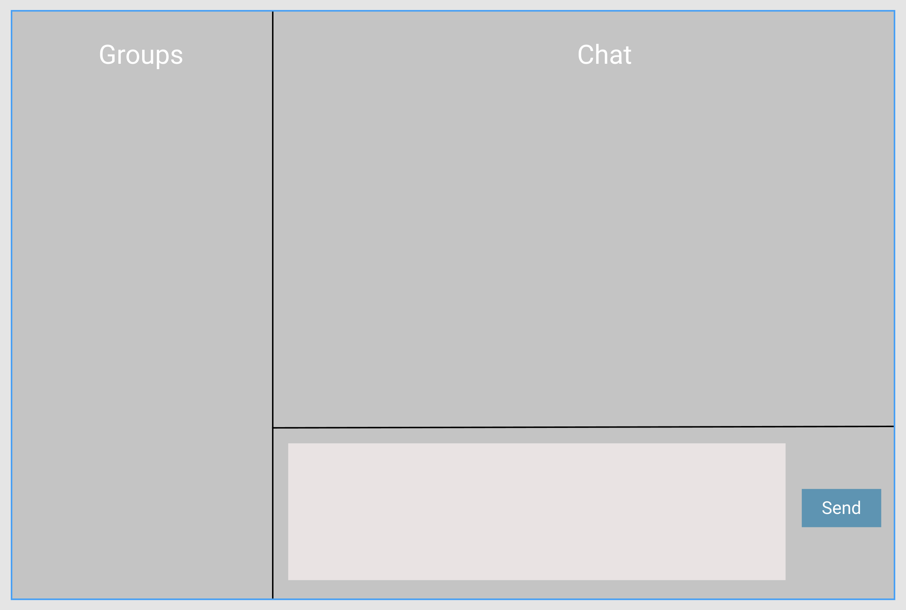
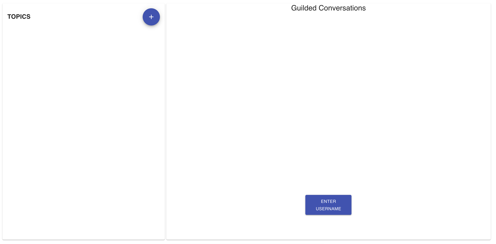
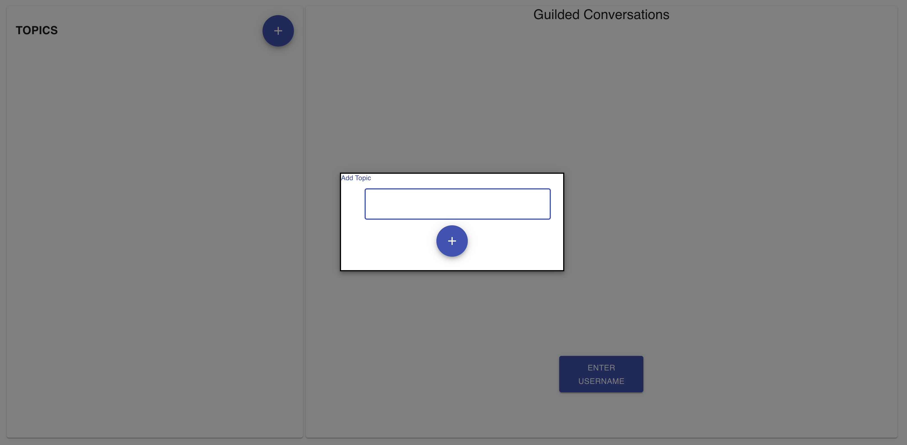
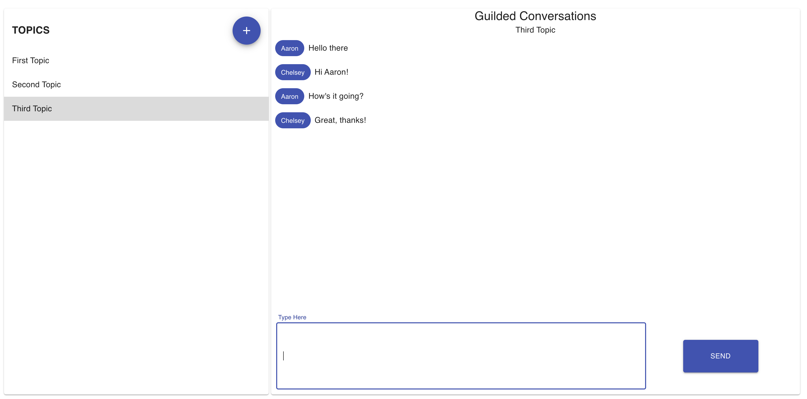

# Guilded Conversations

This project was bootstrapped with [Create React App](https://github.com/facebook/create-react-app), and was created as part of a code challenge for Guild Education.

## Initial WireFrames

## Useful Scripts

In the project directory, you can run:

### `npm start`

Runs the app in the development mode. 

### `node src/server/index.js`

Runs the server locally. Will need to be run in a separate terminal instance than npm start.

### `npm test`

Launches the test runner in the interactive watch mode. 

## Challenges

* Socket.io
  * this was the first time I'd used Socket.io and it was a bit of a challenge to hook it up the way I'd have liked to. Initially my hope was to show a lot more information, like when another user is typing or to load up existing messages on initial login. In the end though, I have run out of a reasonable amount of time to spend on the project and will focus on testing.
* Scope of the project
  * I was a bit over-ambitious with my project and have ended up with less than I originally planned. In the end, I spent more time learning than I should have and probably should have stuck with more known technologies.
  * These opportunities (ie code challenges) are always an opportunity to learn, but if I did it all over again, I would pick fewer of the technologies I am not totally comfortable with and really try to hone in on the ones that I am most excited about or are most necessary to the success of the project.

## Successes

* Socket.io
  * Putting this here as well because the app works! That means I successfully sed something new, which is a win in my book.
* Hooks
  * I am continuing to learn the ins and outs of React Hooks, but am glad I was able to use them throughout the appplication without any huge pitfalls
* Time constraints
  * This project was done while sneaking time in where I could. I am working full time and had friends visiting from out of town for the entire time I worked on this. So, finding the time to work on this was a challenge, and even harder was finding long stretches of time. It takes some ramp-up time to really dive into these things and I am proud to have accomplished what I did in small spurts and without many long stretches of time to really lock in.

## Final Product Screenshots

